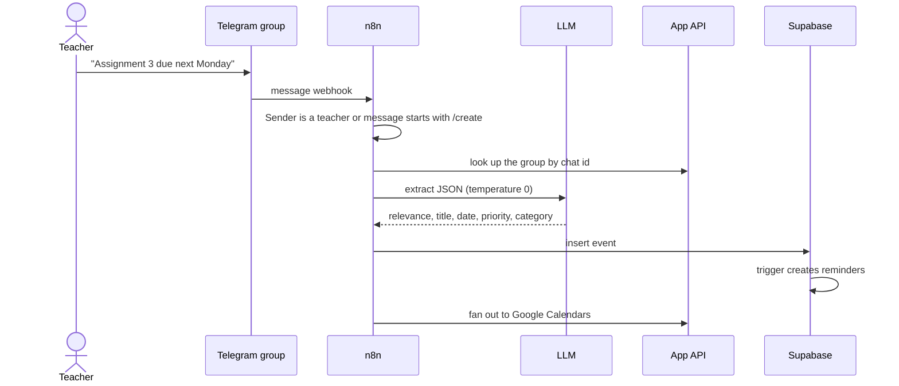

# Methodology

How CampusFlow works out attendance, turns a teacher's message into a dated reminder, falls back when AI is unavailable, and handles whiteboard geometry. Everything here is implemented in `frontend/src/`, `sql/` and `n8n/`.

[← Back to README](./README.md)

## Contents

1. [Attendance maths](#1-attendance-maths)
2. [From a Telegram message to a reminder](#2-from-a-telegram-message-to-a-reminder)
3. [Reminder timing](#3-reminder-timing)
4. [AI use and fallbacks](#4-ai-use-and-fallbacks)
5. [Whiteboard geometry](#5-whiteboard-geometry)
6. [Authentication](#6-authentication)
7. [Limitations](#7-limitations)

---

## 1. Attendance maths

Attendance is **deterministic**, not AI-based. For a subject with $T$ classes held, $A$ attended and a target of $p$ percent (default 75):

$$\text{percentage} = \frac{A}{T}\times 100$$

- If $T = 0$, the result is 100% and the student is not at risk.
- If the percentage is at least $p$, the student is safe, and the number of further classes they can miss is:

$$\text{can skip} = \left\lfloor \frac{100\,A}{p} - T \right\rfloor$$

  This comes from requiring $A / (T + k) \ge p/100$ for $k$ missed future classes.
- Otherwise the student is at risk, and the number of consecutive classes they must attend to reach the target is:

$$\text{needed} = \left\lceil \frac{p\,T - 100\,A}{100 - p} \right\rceil$$

  This comes from requiring $(A + n)/(T + n) \ge p/100$ for $n$ future classes attended.

**Example.** With $T = 40$, $A = 28$ and $p = 75$, the percentage is 70.0%, below target, so $\text{needed} = \lceil (3000 - 2800)/25 \rceil = 8$ classes. With $A = 33$ instead, the percentage is 82.5% and the student can skip $\lfloor 4400/75... \rfloor$, which is $\lfloor 3300/75 - 40 \rfloor = 4$ classes.

The formulas divide by $100 - p$, so a target of exactly 100% produces `Infinity` or `NaN`. The percentage is rounded to one decimal place for display, but the safe or at-risk decision compares the rounded value with the target.

## 2. From a Telegram message to a reminder

1. **Filter.** The n8n workflow ignores a message unless the sender's Telegram ID is in a configured list of teacher IDs, or the message starts with `/create`, and the message has text.
2. **Extract.** An LLM is asked to return a JSON object with `is_relevant`, a short `title`, a `date` as `YYYY-MM-DD`, a `priority` (High, Medium or Low) and a `category` (Exam, Assignment, Attendance, Fee, Placement or Other). Relative dates such as "tomorrow" or "next Monday" are resolved against today's date, and only the most urgent deadline is kept when a message mentions several. The temperature is 0 to keep the output stable.
3. **Store.** Relevant messages are inserted into `events`. Irrelevant ones are dropped silently.
4. **Remind.** A database trigger creates the reminders (see §3).

The app's own webhook route (`groups/webhook/message`) uses the same idea through `extractGroupEvent`, with a lower-case prompt that asks for raw JSON, or `null` when the message is chat.

## 3. Reminder timing

When an event is inserted, a Postgres trigger creates up to three reminder rows, at 7, 3 and 1 days before the event, but only for offsets that are still in the future:

$$\text{create reminder for } d \in \{7, 3, 1\} \quad\text{if}\quad (\text{event date} - \text{today}) \ge d$$

An event 5 days away therefore gets reminders for 3 days and 1 day, but not 7.

An n8n workflow polls the `reminders/due` endpoint every 30 minutes. A reminder is due when the date it should fire is today or earlier and it has not been sent:

$$\text{fire date} = \text{event date} - d \qquad \text{due if } \text{fire date} \le \text{today}$$

Dates are compared as plain dates in UTC, so a reminder can fire a few hours early or late for a user in another time zone. After sending, the workflow marks the reminder as sent. Because "due" means "on or before today", a missed run is made up for on the next poll.

## 4. AI use and fallbacks

| Feature | Model | Notes |
| :--- | :--- | :--- |
| Chat, flashcards, quizzes, short-answer grading, smart tools, notice summary, study tip | Groq `groq/compound` | Temperatures 0.2 to 0.7, with output limits of 200 to 2048 tokens depending on the task |
| Event extraction in n8n | Gemini (configured in the workflow) | Temperature 0 |
| Event extraction in the app route | Groq `groq/compound` | Temperature 0.2 |

**When there is no key or the call fails**, the server returns built-in sample content so the UI keeps working: a canned reply for chat (marked "Demo Mode"), sample flashcards, quiz questions and tool results, and prebuilt flowcharts for a few topics such as sign-up or checkout. Sample output is not based on the student's notes, so it should never be mistaken for a real answer.

**Event extraction without a key** is much cruder: it returns an event titled "Extracted: " plus the first 20 characters of the message, dated tomorrow, for every message. In that mode casual chat becomes an event.

Quiz and short-answer grading are only as good as the model. The score assigned to a short answer comes from the model's judgement and has not been checked against a human grader.

## 5. Whiteboard geometry

The whiteboard draws on an HTML canvas over a virtual world of 4,000 by 4,000 units (from −2000 to +2000 on both axes). The viewport has an offset and a zoom.

**Coordinates.** Screen and world positions convert with the zoom and offset, and zooming changes the zoom by a factor of 1.1 per scroll step in and 0.9 out:

$$\text{world} = \frac{\text{screen}}{\text{zoom}} + \text{offset}$$

**Hit testing.** A click selects the **topmost** shape whose rectangle contains the point, searching from the last drawn shape backwards. Lines and arrows are skipped, because they attach to shapes instead.

**Resize handles.** Each selected shape has eight handles (four corners and four edge midpoints). A handle is hit when the pointer is within $8 / \text{zoom}$ units of it, so handles stay about 8 pixels wide at any zoom. Resizing keeps the opposite edge fixed and enforces a minimum width and height of 20 units.

**Text wrapping.** Words are added to a line until the measured width exceeds the shape's width, then a new line starts. A single word longer than the shape stays on its own line.

**AI diagrams.** A text prompt asks the model for JSON with nodes (with positions, types and labels) and edges, which is turned into shapes and arrows. In the other direction, the canvas is serialized to text such as `Arrow: "A" -> "B" [label]` so a model can describe or convert a diagram to code.

**Auto-save.** Changes are saved by a debounced hook after 3 seconds of inactivity. If the database table is missing or unreachable, the server writes to a local JSON file instead.

## 6. Authentication

- Registration hashes the password with bcrypt (10 rounds). Login compares the hash and returns a token signed with `JWT_SECRET` that expires in 7 days.
- Each protected route reads the bearer token, verifies it and uses the student's ID to filter database rows.
- With `DEV_MODE=true`, the token `dev-token` is accepted as a built-in developer user. This is meant for local development only.

## 7. Limitations

- **Routes called by n8n have no authentication** (see the README's Security section), so the reminder and calendar pipeline can be triggered by anyone who knows the URLs.
- **Reminders use UTC dates** and a coarse 30-minute poll, so exact timing is approximate.
- **Event extraction can be wrong.** It depends on the LLM reading dates correctly, and nothing asks a teacher to confirm the extracted event.
- **Attendance** assumes every class counts equally and ignores holidays, medical exemptions and rounding rules that a college may apply.
- **Sample responses** are generic and do not use your notes.
- **No evaluation** of quiz quality, grading accuracy or extraction accuracy has been done.
