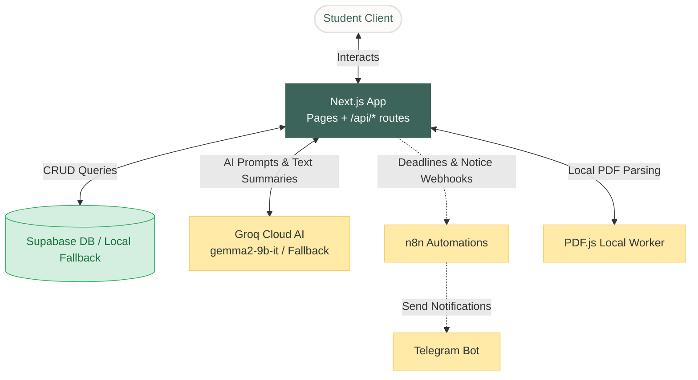
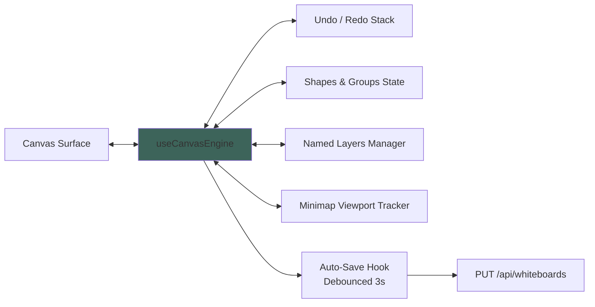
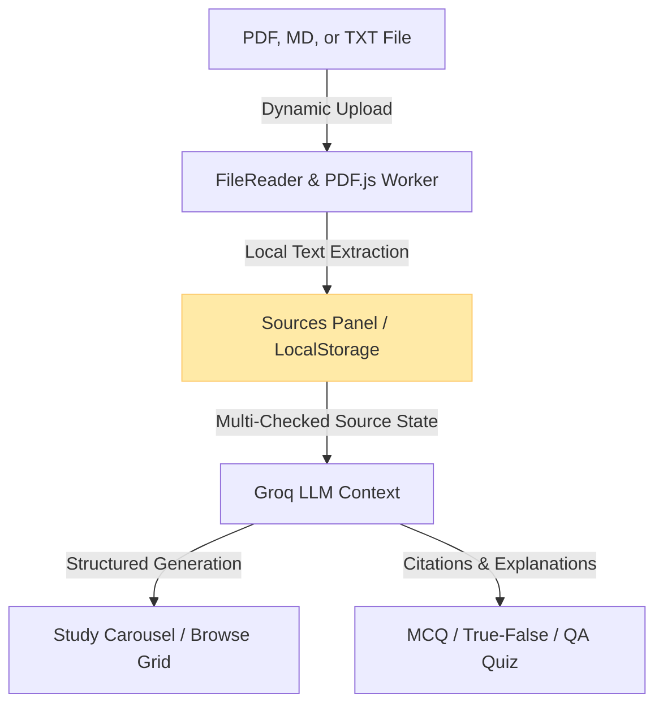

# CampusFlow: AI-Powered Student Hub and Study Assistant

CampusFlow is a production-grade, full-stack campus management and cognitive study assistant platform. It merges automated administrative tools—such as task scheduling, attendance risk metrics, Telegram notifications, and notice broadcasts—with a NotebookLM-inspired study workspace and a visual collaboration whiteboard.

---


## System Architecture

CampusFlow is a single Next.js application: the dashboard UI and the API both live in `frontend/` (App Router pages plus `app/api/**/route.ts` handlers), so there's one process, one deploy, and no cross-origin calls between "frontend" and "backend."



---

## Feature Modules Detail

### 1. Vector Collaboration Whiteboard
The Whiteboard is built directly on native HTML5 Canvas APIs, avoiding heavy third-party canvas engines to maintain high frame rates.



* **Freehand Pen Drawing**: Click-and-drag drawing interface that captures raw points. On completion, the coordinates are adjusted to fit a computed minimum bounding box, and points are translated relative to the shape coordinates. This enables pen drawings to be translated, resized, and grouped just like standard vector shapes.
* **Image Insertion**: Loads images via a client-side file picker. Images are converted to base64 data URLs, loaded into cached image tags, and drawn using the canvas drawing context.
* **Shape Grouping**: Multi-selection via Shift+click allows shapes to be grouped together under a unique ID. Moving or resizing any shape in a group applies the translation transform to all members of the group.
* **Layers System**: Sidebar layer panel supporting locks, visibility toggles, layer creation, and layer list reordering. Rendering loops sort shapes by their assigned layer ID order and skip shapes on hidden layers.
* **Inline Text Editing**: Double-clicking a shape opens an absolute-positioned textarea directly over the shape, scaled by the viewport zoom, replacing browser prompt dialogs.
* **Minimap Projections**: Bottom-right floating canvas projecting the virtual coordinate space (-2000 to +2000) onto a small grid. It renders the viewport boundary using coordinate mapping and allows click-to-pan repositioning.
* **Auto-Save & Fallback**: Automatically updates the whiteboard database state every 3 seconds using a debounced hook. If the Supabase database connection is offline or if the whiteboard table has not been initialized, the system automatically falls back to storing whiteboard JSON payloads locally on the server (`frontend/whiteboards_db.local.json`).

---

### 2. Cognitive Study Assistant (NotebookLM Style)
This module organizes student documents (PDFs, Markdown, and text files) into a unified learning environment.



* **Client-Side Document Parsing**: Extracted text content is read on the client using `FileReader` and an in-browser `PDF.js` worker script. This bypasses server-side parser installation requirements.
* **Unified Sources Manager**: Course notes are saved in a unified source store within `localStorage`. Checking/unchecking documents instantly updates the context used to generate quizzes and flashcards.
* **Interactive Study Carousel**: Flashcards flip 3D on click, and support keyboard listeners (Space to flip, Left/Right arrows to navigate, and number hotkeys to rate mastery).
* **Multi-Format Quiz Generator**: Generates multiple choice, true/false, or graded short-answer questions. Short answers are evaluated by the AI and assigned a score matching model criteria. All quiz outputs feature direct document citations.
* **API Offline Fallback**: If the Groq AI key is unconfigured or returns an error, the API routes intercept the exception and feed high-fidelity structured summary data, roadmaps, and quiz questions to the client, keeping the system functional.

---

### 3. Automated Utilities
* **Notice Summarization**: Summarizes uploaded campus board notices into three concise bullet points containing dates and action items.
* **Telegram Notification Relay**: Integrates with n8n workflows and Telegram Bot API tokens to broadcast notice alerts and task deadlines.
* **Attendance Risk Ledger**: Compares class counts, attended classes, and the minimum target threshold (e.g. 75%) to calculate class skip limits or warn students of risk.
* **Task Planner**: Calendar synchronizer that publishes tasks and deadlines to Google Calendar accounts.

---

## Directory Structure

```
D:/Campus Flow/
├── frontend/
│   ├── src/
│   │   ├── app/
│   │   │   ├── api/                       # API routes (formerly the Express backend)
│   │   │   │   ├── auth/                  # register, login, me, google/*
│   │   │   │   ├── tasks/, notices/, attendance/, automations/
│   │   │   │   ├── ai/                    # Chat, quiz/flashcard generation, smart tools
│   │   │   │   ├── quizzes/, flashcards/  # Persisted quiz/flashcard CRUD
│   │   │   │   ├── whiteboards/           # Whiteboard CRUD (with local JSON fallback)
│   │   │   │   ├── groups/, calendar/, reminders/  # Telegram/n8n automation endpoints
│   │   │   │   └── health/
│   │   │   └── (dashboard)/
│   │   │       └── dashboard/
│   │   │           ├── tools/             # Smart Tools workspace page
│   │   │           └── whiteboard/        # Visual Whiteboard page
│   │   ├── components/
│   │   │   └── shared/
│   │   │       └── Sidebar.tsx            # Dashboard Navigation Sidebar
│   │   ├── features/
│   │   │   └── whiteboard/                # Whiteboard components, hooks, and helpers
│   │   └── lib/
│   │       ├── api.ts                     # Client-side fetch wrapper (calls same-origin /api/*)
│   │       └── server/                    # Server-only: auth (JWT), Supabase, Groq, Google, n8n
│   ├── .env.local                         # Environment configuration (server + client)
│   └── package.json
└── sql/
    └── schema.sql                         # Database Table and Index Definitions
```

---

## Development Setup

### 1. Database Schema Setup
Execute the instructions in [schema.sql](file:///D:/Campus%20Flow/sql/schema.sql) in your Supabase SQL Editor. This initializes tables and indices for students, tasks, notices, attendance, and whiteboards.

### 2. Environment Configuration
Create a `.env.local` file in the `frontend/` directory:
```env
SUPABASE_URL=https://your-supabase-id.supabase.co
SUPABASE_SERVICE_ROLE_KEY=your-supabase-service-role-jwt-key
JWT_SECRET=your-secure-jwt-key
DEV_MODE=false
NEXT_PUBLIC_DEV_MODE=false
GROQ_API_KEY=your-groq-api-key
N8N_DEADLINE_WEBHOOK=https://your-n8n-url/webhook/deadline
N8N_NOTICE_WEBHOOK=https://your-n8n-url/webhook/notice
TELEGRAM_BOT_TOKEN=your-telegram-token
FRONTEND_URL=http://localhost:3000
GOOGLE_CLIENT_ID=your-google-client-id
GOOGLE_CLIENT_SECRET=your-google-client-secret
GOOGLE_REDIRECT_URI=http://localhost:3000/api/auth/google/callback
```
Note: these were previously split across a separate `backend/.env` and `frontend/.env.local` — they now all live in `frontend/.env.local` since there's one app. None of these are prefixed `NEXT_PUBLIC_` (except the dev-mode flag needed client-side to show the dev-login button), so they stay server-only and are never sent to the browser.

### 3. Install & Start

```bash
cd frontend
npm install
npm run dev
```

The app (pages + `/api/*` routes) runs on `http://localhost:3000`.

---

## Testing

Run the test suite in the frontend directory to verify whiteboard math and coordinates translations:
```bash
cd frontend
npm run test
```
All 63 whiteboard math and shape engine tests will run and output their status.
