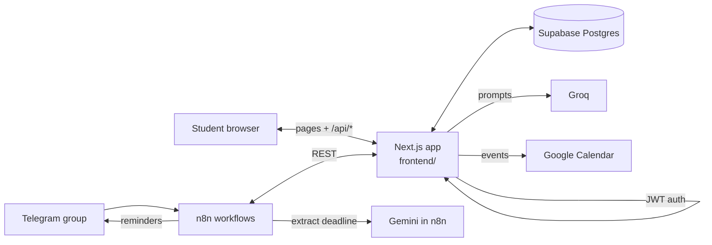

<div align="center">

# CampusFlow

### A student hub with an AI study assistant, a whiteboard and Telegram deadline reminders

_Plan tasks, track attendance, study from your own notes and never miss a deadline posted in a class group._

[](LICENSE)


[Quickstart](#quickstart) · [Features](#features) · [Architecture](#architecture) · [Methodology](./METHODOLOGY.md) · [Security](#security) · [Project status](#project-status) · [Report an issue](https://github.com/ArrinPaul/CampusFlow/issues)

</div>

---

## About

CampusFlow puts the everyday parts of student life in one place. You keep a **task list**, a **notice board** and an **attendance tracker** that tells you how many classes you can still skip. You study with an **AI assistant** that works from your own notes: it chats, makes flashcards, builds quizzes and grades short answers. You sketch ideas on a **whiteboard** and can turn a text description into a flowchart. And through Telegram and [n8n](https://n8n.io), a teacher's announcement in a class group ("assignment due next Monday") is turned into a dated event with automatic reminders.

It is one Next.js application: the pages and the API live together in `frontend/`, data is stored in Supabase, and AI runs on Groq. When no AI key is configured, the AI features fall back to built-in sample responses, so the app still runs.

**Who it's for:** college students, and class representatives who share deadlines in a Telegram group.

> This is a student project under active development. Read [Project status](#project-status) and [Security](#security) before using it with real accounts.

## Table of Contents

1. [About](#about)
2. [Features](#features)
3. [Architecture](#architecture)
4. [Tech stack](#tech-stack)
5. [Quickstart](#quickstart)
6. [Configuration](#configuration)
7. [Data model](#data-model)
8. [API overview](#api-overview)
9. [Security](#security)
10. [Testing](#testing)
11. [Project structure](#project-structure)
12. [Deployment](#deployment)
13. [Project status](#project-status)
14. [Troubleshooting](#troubleshooting)
15. [Documentation](#documentation)
16. [Contributing](#contributing)
17. [License](#license)

## Features

| Area | What it does |
| :--- | :--- |
| **Accounts** | Sign up and log in with a password. Sessions use a 7-day token. You can link a Telegram username and Google Calendar. |
| **Tasks and notices** | A task list with today and upcoming views, and a notice board where a pasted notice can be summarized into three bullet points |
| **Attendance** | Per subject, the percentage, how many more classes you can skip, or how many you need to attend to get back to your target |
| **Study assistant** | Upload PDF, Markdown or text notes (parsed in the browser). Tick the sources to use, then chat, generate flashcards, or generate multiple-choice, true/false and short-answer quizzes |
| **Smart tools** | A workspace of one-click AI tools that work on your notes |
| **Flashcards and quizzes** | Saved decks and quizzes, flip cards with keyboard shortcuts, mastery ratings, and AI grading of short answers |
| **Whiteboard** | A canvas with shapes, freehand pen, images, layers, grouping, undo and redo, a minimap, auto-save, and an AI panel that turns text into a diagram |
| **Telegram deadlines (NotifyMe)** | Register a Telegram group, let the bot read teacher messages, extract deadlines with an LLM, save them as events and send reminders |
| **Calendar sync** | Fan out extracted events to students' Google Calendars |
| **Dashboard** | Widgets for productivity, weekly progress, study streak, upcoming events, recent activity and quick actions |

## Architecture



- **One app.** Next.js route handlers under `src/app/api/` are the back end. The browser calls them on the same origin.
- **Database.** Supabase Postgres, accessed from the server with the service-role key. Each route filters by the signed-in student's ID.
- **AI.** `src/lib/server/groq.js` wraps Groq calls and returns sample content when no key is set.
- **n8n.** Five workflow files in `n8n/` register groups, ingest teacher messages, send reminders and broadcast notices. `n8n/n8n-summary.md` explains them.

The formulas and rules (attendance, reminder timing, event extraction, whiteboard geometry) are in [METHODOLOGY.md](./METHODOLOGY.md).

## Tech stack

| Layer | Technology |
| :--- | :--- |
| Framework | Next.js (App Router), React 19, TypeScript |
| UI | Tailwind CSS 4, shadcn and Base UI, Framer Motion, GSAP, Lenis, Lucide icons |
| Data | Supabase (PostgreSQL) |
| Auth | Password hashing with `bcryptjs`, signed tokens with `jsonwebtoken`, Google OAuth for Calendar |
| AI | Groq (`groq-sdk`, model `groq/compound`), Gemini inside n8n |
| Documents | `PDF.js` in the browser, `react-markdown`, `mermaid` |
| Automation | n8n and the Telegram Bot API |
| Testing | Vitest |
| Hosting config | Vercel (`vercel.json`), Render (`render.yaml`) |

## Quickstart

Prerequisites: Node.js 20 or newer (the root `package.json` asks for 24.x) and a [Supabase](https://supabase.com) project. A [Groq](https://console.groq.com) key is optional.

```bash
git clone https://github.com/ArrinPaul/CampusFlow.git
cd CampusFlow/frontend
npm install
```

**1. Create the database.** In the Supabase SQL editor, run the files in `sql/` in this order: `schema.sql`, `quizzes_schema.sql`, `flashcards_schema.sql`, then `notifyme-migration.sql`. (`seed_dev_user.sql` and `seed_test_group.sql` add sample data.)

**2. Create `frontend/.env.local`:**

```env
SUPABASE_URL=https://your-project.supabase.co
SUPABASE_SERVICE_ROLE_KEY=your-service-role-key
JWT_SECRET=a-long-random-string
GROQ_API_KEY=optional-groq-key
DEV_MODE=false
NEXT_PUBLIC_DEV_MODE=false
```

**3. Run it:**

```bash
npm run dev          # http://localhost:3000
```

Sign up on the login page. The Telegram and n8n features need extra setup (see [Configuration](#configuration)).

## Configuration

Set these in `frontend/.env.local` (local) or in your host's environment settings.

| Variable | Required | Purpose |
| :--- | :---: | :--- |
| `SUPABASE_URL`, `SUPABASE_SERVICE_ROLE_KEY` | Yes | Database access. The service-role key is a secret and bypasses row-level security. |
| `JWT_SECRET` | Yes | Signs login tokens. Use a long random value. |
| `GROQ_API_KEY` | No | Enables real AI. Without it the app returns built-in sample responses. |
| `DEV_MODE`, `NEXT_PUBLIC_DEV_MODE` | No | When `DEV_MODE=true`, the bearer token `dev-token` is accepted as a built-in developer user. **Never enable in production.** |
| `N8N_DEADLINE_WEBHOOK`, `N8N_NOTICE_WEBHOOK` | No | URLs of your n8n workflows, called when tasks or notices are created |
| `GOOGLE_CLIENT_ID`, `GOOGLE_CLIENT_SECRET`, `GOOGLE_REDIRECT_URI` | No | Google OAuth for Calendar sync |
| `FRONTEND_URL` | No | Public URL, used in links |
| `TELEGRAM_BOT_TOKEN` | No | Listed in `render.yaml` for the Telegram bot |

## Data model

SQL files in `sql/` create these tables.

| File | Tables |
| :--- | :--- |
| `schema.sql` | `students`, `tasks`, `notices`, `attendance`, `automation_logs`, `preferences`, `whiteboards` |
| `quizzes_schema.sql` | `quizzes`, `quiz_questions` |
| `flashcards_schema.sql` | `flashcard_decks`, `flashcards` |
| `notifyme-migration.sql` | `telegram_groups`, `group_members`, `events`, `reminders` |

## API overview

Route handlers live in `frontend/src/app/api/`.

| Group | Routes |
| :--- | :--- |
| Auth | `auth/register`, `auth/login`, `auth/me`, `auth/google/*` |
| Planner | `tasks` (with `today`, `upcoming`), `notices` (with `broadcast`), `attendance` |
| AI | `ai/chat`, `ai/quiz`, `ai/flashcards`, `ai/grade-short-answer`, `ai/tool/[toolSlug]`, `ai/tip`, `ai/attendance-alert` |
| Study content | `quizzes` (with `submit`), `flashcards/decks`, `whiteboards` |
| Telegram and reminders | `groups/*`, `reminders/due`, `reminders/[id]/mark-sent`, `calendar/fan-out`, `automations` |
| Health | `health` |

## Security

What exists:

- Passwords are hashed with bcrypt, and tokens are signed and expire after 7 days.
- Student data routes require a valid token and filter rows by the signed-in student's ID.
- Secrets live in environment variables, and server-only modules are marked `server-only`.

**Known gaps. Fix these before real use.**

- **Several routes have no authentication.** The ones called by n8n (`groups/register`, `groups/by-chat-id`, `groups/webhook/message`, `reminders/due`, `reminders/[id]/mark-sent`, `calendar/fan-out`) check no token, so anyone who finds the URL can call them. For example `reminders/due` lists every unsent reminder. Protect them with a shared secret header checked in the handler and set in n8n.
- **`DEV_MODE` is a backdoor if left on.** With `DEV_MODE=true`, the token `dev-token` logs anyone in as a built-in user.
- **The login token carries the whole student record**, and the service-role database key bypasses row-level security, so the correctness of every route's `student_id` filter is the only data barrier.
- **No rate limiting** on login, registration or the AI routes.

## Testing

```bash
cd frontend
npm test            # Vitest
npm run lint
```

Two Vitest files cover the whiteboard geometry and shape helpers (`src/features/whiteboard/__tests__/`). Nothing else has automated tests, and there is no CI. I could not run the install and test commands while writing this README, so the current pass state is unverified.

## Project structure

```text
CampusFlow/
├── frontend/                 The Next.js app
│   └── src/
│       ├── app/(auth)/       Login and sign-up pages
│       ├── app/(dashboard)/  Dashboard, tools and whiteboard pages
│       ├── app/api/          Route handlers (the back end)
│       ├── features/whiteboard/   Canvas engine, components, hooks, tests
│       ├── components/       Dashboard widgets, sidebar, shared UI
│       └── lib/server/       Auth, Supabase, Groq, Google and n8n helpers
├── sql/                      Database schema and seed files
├── n8n/                      Importable n8n workflows and a summary
├── CONTEXT.md, DESIGN.md, Rules.md   Project notes
├── render.yaml, vercel.json  Hosting configuration
├── METHODOLOGY.md
└── LICENSE
```

## Deployment

`vercel.json` and `render.yaml` are provided (the Render service uses `frontend/` as its root and `/api/health` as the health check). Set the variables from [Configuration](#configuration) in the host, make sure `DEV_MODE` is `false`, run the SQL files on the production database, and import the n8n workflows with their `BACKEND_URL` variable pointing at your deployment. The demo URL listed on the repository currently returns 404.

## Project status

- **Telegram and n8n flows are the least verified part.** They depend on external accounts and were not exercised here.
- **Unauthenticated automation routes** (see [Security](#security)).
- **The no-key fallback for event extraction is crude.** Without `GROQ_API_KEY`, every message sent to the webhook becomes an event titled "Extracted: ..." dated tomorrow, even casual chat.
- **Corrupted characters.** The attendance warning message in `src/lib/server/groq.js` contains garbled emoji characters from an encoding mistake.
- **A local data file is committed.** `frontend/whiteboards_db.local.json` is the whiteboard fallback store and should not be in version control.
- **Documented model differs from the code.** Older notes mention `gemma2-9b-it`. The code calls `groq/compound`.
- **Tests and CI are minimal** (see [Testing](#testing)).

## Troubleshooting

| Symptom | Likely cause | Fix |
| :--- | :--- | :--- |
| "Supabase not configured" | `SUPABASE_URL` or the service-role key is missing or `placeholder` | Set both in `frontend/.env.local` and restart. |
| Login always returns "Invalid token" | `JWT_SECRET` changed or is missing | Use one stable secret and log in again. |
| AI answers say "Demo Mode" | No valid `GROQ_API_KEY` | Add a Groq key. |
| Whiteboards save but are missing after a restart on a host | The database table is not set up, so it used the local file fallback | Run `sql/schema.sql`. |
| Telegram reminders never arrive | n8n is not running, the workflow variables are missing or the bot is not in the group | Check `n8n/n8n-summary.md` and the workflow variables. |
| Attendance shows "Need Infinity more classes" (or NaN) | A target of 100% was entered, which divides by zero | Use a target below 100. |

## Documentation

| Document | Purpose |
| :--- | :--- |
| [METHODOLOGY.md](METHODOLOGY.md) | Attendance formulas, reminder timing, event extraction, whiteboard maths and AI fallbacks |
| [n8n/n8n-summary.md](n8n/n8n-summary.md) | What each n8n workflow does |
| [CONTEXT.md](CONTEXT.md), [DESIGN.md](DESIGN.md), [Rules.md](Rules.md) | Project context, design notes and working rules |

## Contributing

Issues and pull requests are welcome. Run `npm run lint` and `npm test` in `frontend/` before opening a PR, never commit `.env.local` or real keys, and keep database changes in `sql/`.

## License

Released under the MIT License. See [LICENSE](LICENSE).
